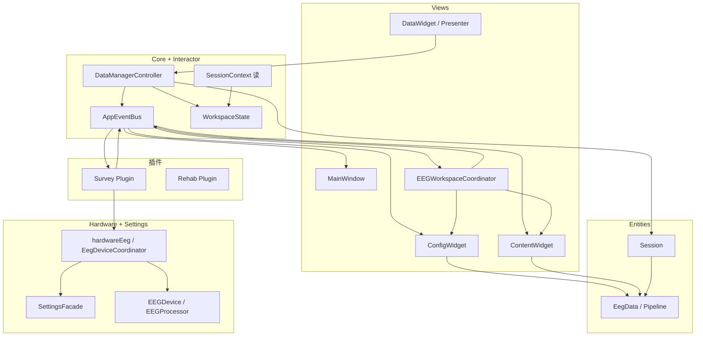
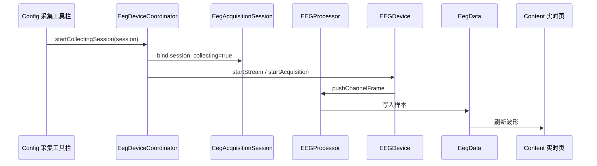
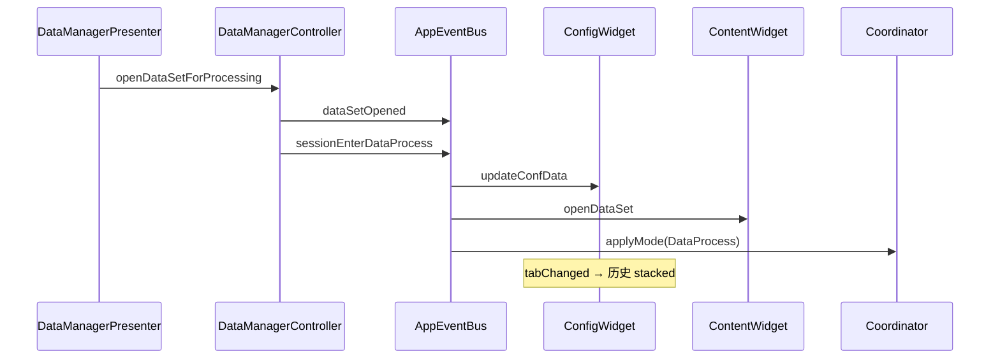

# 关系图与排错清单

## 组件总览（Mermaid）

## 实时采集数据流（Mermaid）

## 打开离线数据流（Mermaid）

## 排错清单

### 中间页不对（历史/实时）

1. Config **当前 Tab 索引**是否正确  
2. `EEGWorkspaceCoordinator::syncMiddleStackFromConfigTab` / `resolvedMiddleStackIndex`  
3. 是否误用 `WorkspaceMode` 去切 stacked（应只由 Config Tab 驱动）

### Bus 事件没到 UI

1. `MainWindow::initApplicationArchitecture` 是否调用 `wireController`  
2. Controller 是否 emit（打开数据、进入采集路径是否正确）  
3. 订阅方 connect 是否在 `Coordinator::wire` / MainWindow 内完成

### Session 焦点不对

1. 写入是否绕过 Controller（应禁止）  
2. 读侧是否用 `SessionContext`  
3. Content Tab 切换是否触发 `activateProcessingSession`

### 采集/录制异常

1. `hardwareEeg()->isDeviceConnected()`  
2. `startCollectingSession` vs 仅 `startStream`  
3. `SettingsFacade` 双通道/电极与 `EEGProcessor` 合并  
4. `RecordingController`、存储路径

### 编译 C2027 EegDeviceCoordinator 未定义

调用 `hardwareEeg()->成员` 的翻译单元需 `#include "Hardware/EEG/EegDeviceCoordinator.h"`（`HardwareContext.h` 仅前向声明）。

## 仓库内文档对照

| 现象 | 读 |
|------|-----|
| Config/Content 分工 | `docs/EEG_WORKSPACE.md` |
| Session 写入与 Bus 表 | `docs/SESSION_WORKFLOW.md` |
| Device legacy | `docs/HARDWARE_DEVICE_CUTOVER.md` |
