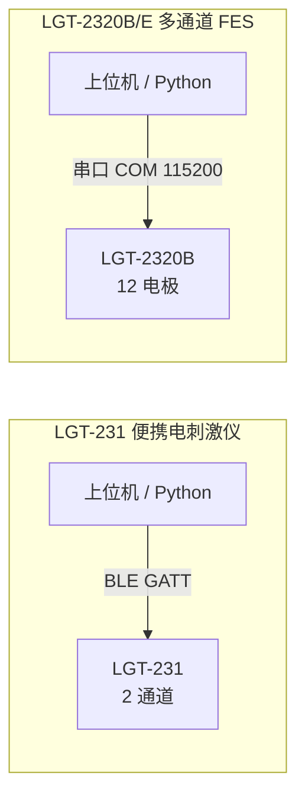

# 康复设备接口分析：LGT-231 与 LGT-2320B/2320E


## 设备对比总览

| 项目         | LGT-231                 | LGT-2320B / 2320E                                  |
| ---------- | ----------------------- | -------------------------------------------------- |
| 设备类型       | 便携式康复电刺激设备              | 多通道功能性电刺激（FES）设备                                   |
| 厂商         | LONGEST（龙杰）             | LONGEST（龙杰）                                        |
| 连接方式       | **蓝牙 BLE GATT**         | **串口（COM）**，CH341 芯片                               |
| 通道数        | 2 通道（CH1、CH2）           | 12 电极通道（分 2 组，每组 6 路）                              |
| 主要用途       | TENS / NMES / MCR 等治疗模式 | 感觉/运动阈值检测、NMES 刺激输出                                |
| Python API | `lgt231_api.py`         | `fes_controler.py`（`StimDevice` 类）                 |
| 原始协议文档     | `已解密_康复版指令.docx`        | `已解密_CP01通信协议-2320.xlsx`、`已解密_LGT-2320BE指令操作.docx` |

---

## 1. LGT-231

### 1.1 设备概述

LGT-231 是一款**便携式康复电刺激治疗仪**，通过蓝牙无线连接，支持多种刺激模式：

| 模式类别 | 具体模式                                  | Command ID      |
| ---- | ------------------------------------- | --------------- |
| TENS | Normal、Burst、Sweep、Random、Alternation | `0x81` ~ `0x85` |
| NMES | 单通道、同步输出、交替输出                         | `0x86` ~ `0x88` |
| MCR  | 微电流康复                                 | `0x89`          |
| 痉挛肌电 | Spastic EMG                           | `0x79`          |

- 双通道输出（CH1、CH2，可独立或同时控制）
- 适合便携、无线场景（蓝牙直连控制）
- 支持电池电量监测、设备信息读取

### 1.2 连接方式

**蓝牙 BLE GATT**，主机作为 BLE Central，设备作为 BLE Peripheral。

当前资料**未提供**串口、USB、TCP/IP 或 HTTP 等其他连接方式。

#### GATT 服务与特征

| 服务                  | UUID                                   | 特征                | 特征 UUID                                | 属性                        | 说明            |
| ------------------- | -------------------------------------- | ----------------- | -------------------------------------- | ------------------------- | ------------- |
| Battery Service     | `0000180f-0000-1000-8000-00805f9b34fb` | Battery Level     | `00002a19-0000-1000-8000-00805f9b34fb` | READ / NOTIFY             | 电池电量 0~100%   |
| Device Information  | `0000180a-0000-1000-8000-00805f9b34fb` | Manufacturer Name | `00002a29-0000-1000-8000-00805f9b34fb` | READ                      | 厂商名称（LONGEST） |
| Device Information  | `0000180a-0000-1000-8000-00805f9b34fb` | Hardware Revision | `00002a27-0000-1000-8000-00805f9b34fb` | READ                      | 硬件版本          |
| Device Information  | `0000180a-0000-1000-8000-00805f9b34fb` | Software Revision | `00002a28-0000-1000-8000-00805f9b34fb` | READ                      | 软件版本          |
| **Cure Parameters** | `00000001-0000-1000-8000-00805f9b34fb` | Cure Parameters   | `00000001-0000-1000-8000-00805f9b34fb` | **WRITE / READ / NOTIFY** | 治疗参数与控制命令（核心） |

#### 依赖库

实际连接设备需安装 `bleak`：

```bash
pip install bleak
```

### 1.3 协议格式

#### 帧结构

治疗参数特征的写入、读取和通知数据均按同一帧格式处理：

```
[Command ID (1B)] [Command Size (1B)] [Command (0~18B)] [Check Sum (1B)]
```

| 字段 | 长度 | 说明 |
|------|------|------|
| Command ID | 1 byte | 命令字 |
| Command Size | 1 byte | Command 数据区长度 |
| Command | 0~18 byte | 命令参数 |
| Check Sum | 1 byte | 校验和 |

#### 校验和规则

```
Check Sum = (Command ID + Command Size + Command 每个字节求和) & 0xFF
```

#### 参数编码（BCD）

频率、脉宽、时间等数值按 **BCD 编码**，不是普通十六进制整数：

| 参数 | 示例值 | 编码字节 |
|------|--------|----------|
| 频率 50 Hz | 50 | `50 00` |
| 脉宽 100 μs | 100 | `00 01` |
| 治疗时间 60 min | 60 | `60` |
| 上升时间 500 ms | 500 | `00 05` |

#### 帧示例

TENS Normal，双通道，50 Hz，100 μs，60 min：

```text
81 06 03 50 00 00 01 60 3B
```

| 字节      | 含义                     |
| ------- | ---------------------- |
| `81`    | Command ID，TENS Normal |
| `06`    | Command Size，参数区 6 字节  |
| `03`    | 通道 1 + 通道 2            |
| `50 00` | 频率 50 Hz               |
| `00 01` | 脉宽 100 μs              |
| `60`    | 治疗时间 60 min            |
| `3B`    | 校验和                    |

### 1.4 常用命令字

| Command ID | API 函数 | 功能 |
|------------|----------|------|
| `0x79` | `spastic_emg()` | 设置痉挛肌电刺激模式 |
| `0x80` | `start_treatment()` / `stop_treatment()` | 开始或停止治疗 |
| `0x81` | `tens_normal()` | 设置 TENS Normal 模式 |
| `0x82` | `tens_burst()` | 设置 TENS Burst 模式 |
| `0x83` | `tens_sweep()` | 设置 TENS Sweep 模式 |
| `0x84` | `tens_random()` | 设置 TENS Random 模式 |
| `0x85` | `tens_alternation()` | 设置 TENS Alternation 模式 |
| `0x86` | `nmes_single()` | 设置 NMES 单通道模式 |
| `0x87` | `nmes_sync()` | 设置 NMES 同步输出模式 |
| `0x88` | `nmes_alternation()` | 设置 NMES 交替输出模式 |
| `0x89` | `mcr()` | 设置 MCR 参数 |
| `0x8A` | `set_intensity()` | 设置输出强度 |
| `0x8B` | `query_status()` | 查询设备状态及当前设置 |
| `0x8C` | `read_history()` | 读取历史治疗数据 |
| `0x8D` | `sync_output_stage()` | 同步脉冲群输出状态 |
| `0x8E` | `change_frequency()` / `change_pulse_width()` | 运行中改变频率或脉宽 |
| `0x90` | `parse_alarm()` | 报警通知（如开路报警） |
| `0x91` | `parse_error()` | 错误通知（参数/校验错误） |

### 1.5 控制流程

推荐的治疗控制顺序：

1. 连接设备（BLE 扫描或按地址直连）
2. 订阅 Cure Parameters 的 NOTIFY
3. 写入治疗模式参数（如 `0x81` TENS Normal）
4. 写入输出强度（`0x8A`）
5. 写入开始治疗（`0x80`，状态 `0xFF`）
6. 运行中按需查询状态（`0x8B`）、同步输出阶段（`0x8D`）
7. 写入停止治疗（`0x80`，状态 `0x00`）
8. 取消通知并断开连接

#### Python 示例

```python
import asyncio
from lgt231_api import Channel, LGT231BleClient, set_intensity, start_treatment, tens_normal

async def main():
    async with LGT231BleClient("设备名称或地址") as client:
        await client.write_frame(
            tens_normal(
                channel=Channel.BOTH,
                frequency_hz=50,
                pulse_width_us=100,
                treatment_minutes=60,
            )
        )
        await client.write_frame(set_intensity(channel=Channel.BOTH, intensity_ma=50))
        await client.write_frame(start_treatment())

asyncio.run(main())
```

### 1.6 通道枚举

| 枚举 | 值 | 说明 |
|------|-----|------|
| `Channel.CH1` | `0x01` | 通道 1 |
| `Channel.CH2` | `0x02` | 通道 2 |
| `Channel.BOTH` | `0x03` | 通道 1 和通道 2 |

---

## 2. LGT-2320B / 2320E

### 2.1 设备概述

LGT-2320B/2320E 是一款**多通道功能性电刺激（FES）设备**，面向临床/实验场景：

- 支持 **12 路电极**独立控制（分 2 个通道组，每组 6 路）
- 用于感觉阈值、运动阈值的阶梯式检测
- 支持 NORMAL、SWEEP、RANDOM、ALTERNATE 等输出模式
- 设备 ID：`0x07`，设备名：`LGT2320B`
- 通过 CH341 串口芯片连接上位机

### 2.2 连接方式

**串口（RS232/USB）通信**，使用 CH341 芯片驱动。

| 参数 | 值 | 说明 |
|------|-----|------|
| 接口 | COM 口 | 如 `COM5` |
| 波特率 | `115200` | API 默认值，协议文档未明确，待实机确认 |
| 驱动 | CH341SER.EXE | 串口芯片驱动安装程序 |

#### 地址定义

| 角色 | 地址 |
|------|------|
| PC（上位机） | `0x01` |
| 电疗控制板 | `0x02` |
| LGT2320B 设备 ID | `0x07` |

### 2.3 协议格式（CP01）

#### 帧结构

```
[包头 0x4C47 (2B)] [CRC16_IBM (2B)] [地址 (1B)] [命令字 (1B)] [错误码 (1B)] [长度 (2B)] [有效数据 (N B)]
```

| 字段 | 类型 | 说明 |
|------|------|------|
| 协议包头 | U16 | 固定 `0x4C47`（ASCII "LG"），小端发送为 `47 4C` |
| 校验位 | U16 | CRC16_IBM，对校验位之后的所有数据计算 |
| 地址 | U8 | 目标或来源地址 |
| 命令字 | U8 | 命令编码 |
| 错误码 | U8 | `0x00` 表示正常 |
| 长度 | U16 | 有效数据长度 |
| 有效数据 | bytes | 命令参数 |

- 字节序：**小端模式**
- 上位机错误码：固定 `0x00`

### 2.4 核心命令字

| 命令字 | API 函数 | 功能 |
|--------|----------|------|
| `0xA6` | `get_device_info()` | 获取设备信息 |
| `0x01` | `set_output_mode()` | 设置输出模式（频率、脉宽、治疗时间等） |
| `0xA7` | `control()` | 启动/停止/暂停治疗 |
| `0xA9` | `set_intensity()` | 设置输出强度 |
| `0xA8` | `get_alarm_info()` | 读取告警状态 |
| `0xAA` | `get_knob_value()` | 读取飞梭旋钮状态和值 |
| `0xAB` | `get_nmes_status()` | 读取 NMES 治疗阶段状态 |
| `0xAC` | `set_frequency_or_pulse_width()` | 设置频率或脉宽 |
| `0xAD` | `get_online_status()` | 读取目标板在线状态 |

### 2.5 输出模式参数（0x01）

| 字段 | 类型 | API 参数 | 协议范围 |
|------|------|----------|----------|
| 通道 | U8 | `channel_group` | 1..4 |
| 治疗时间 | U8 | `treat_time` | 5..95 min |
| 脉冲宽度 | U16 | `pulse_width` | 80..400 μs |
| 模式 | U8 | `mode` | NORMAL=0x01、SWEEP=0x04、RANDOM=0x07、ALTERNATE=0x0A |
| 下限频率 | U8 | `lower_frequency` | 1..120 Hz |
| 上限频率 | U8 | `upper_frequency` | 1..120 Hz |
| 保持时间 | U8 | `hold_time` | 1..30 s |
| 间歇时间 | U8 | `rest_time` | 2..60 s |
| 上升时间 | U8 | `rise_time` | 0..5 s |
| 下降时间 | U8 | `fall_time` | 0..5 s |

### 2.6 通道组织

#### 通道组

| 通道组 | 电极范围 | 说明 |
|--------|----------|------|
| 1 | 电极 1~6 | CH1~CH6 |
| 2 | 电极 7~12 | CH7~CH12 |
| 3 | — | CV Output |
| 4 | 电极 1~12 | 全部通道 |

#### 电极位掩码（0xA9 设置强度）

| 电极 | 掩码 |
|------|------|
| 1 | `0x0001` |
| 2 | `0x0002` |
| 3 | `0x0004` |
| 4 | `0x0008` |
| 5 | `0x0010` |
| 6 | `0x0020` |
| 7 | `0x0100` |
| 8 | `0x0200` |
| 9 | `0x0400` |
| 10 | `0x0800` |
| 11 | `0x1000` |
| 12 | `0x2000` |
| 13 | `0x4000` |

> 强度值协议要求**扩大 10 倍**传输。例如 `intensity=5` 实际发送原始值 `50`。

### 2.7 控制流程

阈值检测主程序（`auto_prestimulus_intensity.py`）典型流程：

1. 初始化日志，读取 `config.json` 配置
2. 交互选择串口（如 `COM5`）
3. 交互选择待检测电极
4. 初始化 `StimDevice`，查询设备信息（`0xA6`）
5. 为两个通道组设置输出模式和刺激参数（`0x01`）
6. 逐个电极检测感觉阈值（强度递增，受试者按键确认）
7. 基于感觉阈值检测运动阈值
8. 保存报告到 `result/`，更新 `config.json`
9. 退出或异常时关闭所有通道组并关闭串口

#### Python 示例

```python
from fes_controler import StimDevice

tool = StimDevice("COM5", timeout=0.15, log_level="INFO")
try:
    info = tool.get_device_info()
    tool.set_output_mode(
        channel_group=1,
        pulse_width=80,
        treat_time=5,
        rise_time=5,
        fall_time=5,
        hold_time=3,
        rest_time=3,
    )
    tool.set_intensity(channels=[1], intensity=5)
    tool.control(channel_group=1, enable=True)
finally:
    tool.close()
```

---

## 3. 架构对比



### 协议层对比

| 对比项 | LGT-231 | LGT-2320B/E |
|--------|---------|-------------|
| 传输层 | BLE GATT | 串口 RS232/USB |
| 帧头 | 无（Command ID 即首字节） | `0x4C47`（"LG"） |
| 校验 | 简单累加和（低 8 位） | CRC16_IBM |
| 参数编码 | BCD | 小端二进制 |
| 通知机制 | BLE NOTIFY 订阅 | 串口响应帧 |
| 通道规模 | 2 通道 | 12 电极 / 4 通道组 |
| 无线能力 | 支持 | 不支持 |

---

## 4. 安全注意事项

### LGT-231

- 治疗类设备存在输出强度风险，联调时建议先设置较低强度
- 确认电极连接状态后再启动治疗
- 设备返回 `0x90` 且报警类别 `0x01` → 开路报警，检查通道连接
- 设备返回 `0x91` 且错误类别 `0x02` → 校验和或字段长度错误

### LGT-2320B/E

- 使用前确认电极连接、通道选择和人体安全条件
- 阈值检测中按 `ESC` 触发紧急停止，脚本会关闭所有通道组
- 程序异常时也会尝试关闭通道组 1、2、3 并关闭串口
- `MAX_INTENSITY` 默认 50 级，修改前确认临床/实验安全边界
- 设备无响应时检查：CH341 驱动、COM 号、串口占用、设备供电

---

## 5. 待实机确认项

### LGT-231

- 部分 Command ID（`0x8F`、`0xA0`、`0xA1`、`0xA2`）原始文档字段未完整定义
- `0x8B` 状态通知长度存在 3/4 字节歧义

### LGT-2320B/E

- 串口波特率是否确认为 `115200`
- 设备对 `0x01`、`0xA7`、`0xA9` 是否每次都返回响应
- 强度"级"与实际电流/电压单位的临床映射关系

---

## 6. 参考文件

| 设备 | 工程路径 | 关键文件 |
|------|----------|----------|
| LGT-231 | `现有康复设备接口总结/LGT-231/` | `lgt231_api.py`、`LGT231_API_使用说明.md`、`已解密_康复版指令.docx` |
| LGT-2320E | `现有康复设备接口总结/2320E/` | `fes_controler.py`、`auto_prestimulus_intensity.py`、`已解密_CP01通信协议-2320.xlsx` |
